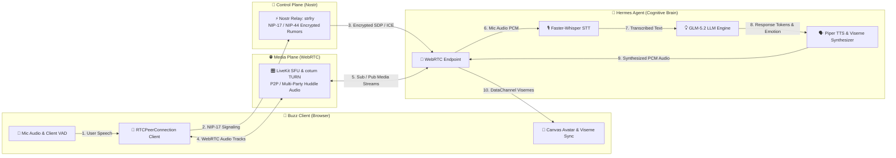

# payphone

> **FaceTime for AI Agents: Addressable, P2P/SFU voice calls & real-time lip-sync over Nostr.**

[](https://github.com/NickAiNYC/payphone/actions/workflows/ci.yml)
[](https://opensource.org/licenses/MIT)

A local-first, decentralized framework that turns LLM agents into fully interactive, embodied digital teammates. Enables direct 1:1 voice calls to agents, multi-participant SFU huddles, real-time viseme-based canvas lip-sync, and cryptographically private NIP-17 signaling without a central server.



---

## High-Level Architecture

The system is deliberately split into three clean planes:

| Plane | Responsibility | Key Technologies |
| :--- | :--- | :--- |
| **Control Plane** | Identity, signaling, consent, state | Nostr (NIP-17 gift-wrap, NIP-44 encryption, custom kinds 21001–21009) |
| **Media Plane** | Real-time audio + data | WebRTC (P2P for 1:1, LiveKit SFU for Huddles) + DataChannels |
| **Cognitive Plane** | Intelligence + memory | GLM-5.2 + Hermes persistent memory + skill learning loop |

This separation is what makes the system modular, secure, and future-proof.

---

## Core Capabilities

1. **Real-time Embodiment**
   * HTML5 Canvas avatar with real viseme lip-sync (derived from Piper phoneme timings).
   * Emotion-driven facial expressions.
   * Client-side VAD + full echo cancellation / noise suppression.
   * Gated transmission (only active speech is transmitted over WebRTC).

2. **Decentralized & Private by Default**
   * All call invitations and sensitive signaling are NIP-17 gift-wrapped.
   * Call recordings are client-side only, AES-256-GCM encrypted, and key-wrapped per participant.
   * Cryptographic consent model (`kind 21005`) scoped per agent (local-first grant fallback for offline dev, fail-closed evaluation when relay client is attached).
   * Local-first defaults: `faster-whisper` + `Piper` + `Silero` + local `GLM-5.2`.

3. **Multi-Party Huddles**
   * 1:1 P2P calls + multi-party SFU Huddles.
   * Floor control (speaking requests, active speaker focus).
   * Multiple agents and humans co-existing in the same room.
   * Live avatar state synchronized over DataChannels.

4. **Self-Improving Agent**
   * Full interaction traces captured (transcript, tools, barge-ins, emotions, avatar events).
   * Structured summarization via GLM-5.2.
   * `SkillRefiner` proposes concrete improvements after every call.

5. **Developer Experience**
   * One-command Docker Compose deployment.
   * GPU-aware containers.
   * Clean adapter interfaces (STT / TTS / VAD / SFU / Renderer).
   * Hermes desktop plugin + Buzz React components.

---

## Quick Start (Docker Compose)

Deploy the entire workspace (Strfry Nostr Relay, LiveKit SFU, coturn TURN Server, Hermes Agent, and Buzz Web Client) with a single command:

1. **Clone the Repository**
2. **Setup Environment Variables**
   ```bash
   cp .env.example .env
   # Edit .env with your GLM_API_KEY or OPENAI_API_KEY
   ```
3. **Download Piper Voice Models** (Local-first TTS requires ONNX models):
   ```bash
   mkdir -p models/piper
   cd models/piper
   curl -L -O https://huggingface.co/rhasspy/piper-voices/resolve/v1.0.0/en/en_US/ryan/high/en_US-ryan-high.onnx
   curl -L -O https://huggingface.co/rhasspy/piper-voices/resolve/v1.0.0/en/en_US/ryan/high/en_US-ryan-high.onnx.json
   cd ../..
   ```
4. **Boot Stack**
   ```bash
   make dev
   ```
5. **Access the Client**
   Open **[http://localhost:3000/](http://localhost:3000/)** in your browser.

---

## Development & Architecture Deep Dive

Please refer to the [DEVELOPING.md](DEVELOPING.md) developer manual for:
* Comprehensive directory & plane mappings.
* Instructions on writing custom STT, TTS, VAD, and LLM adapters.
* Guidelines for extending the `AvatarStateMachine` or building custom renderer states.
* Security operations (firewall rules, private key storage, consent revocations).
* Testing guidelines.

---

## Current Status & Roadmap

- [x] **Phase 0**: Core three-plane architecture (Control, Media, Cognitive).
- [x] **Phase 1**: Real-time audio pipeline, WebRTC signaling, client VAD, and Canvas lip-sync.
- [x] **Phase 2**: Cryptographically private NIP-17/NIP-44 signaling and consent policy engine.
- [x] **Phase 3**: Multi-party SFU Huddles and floor control.
- [x] **Phase 4**: Self-improving cognitive memory loop and skill refiner.
- [x] **Phase 5**: Production operations, Docker Compose stack orchestration, and test suite.
- [ ] **Phase 6**: Native mobile wrappers for Buzz (React Native).
- [ ] **Phase 7**: Support for high-fidelity 3D WebGL avatar pipelines.

